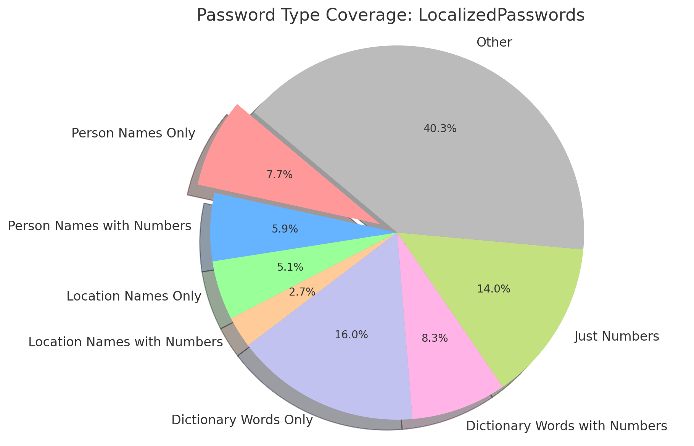

## Project Overview

Research shows that a significant portion of passwords follows certain patterns. By analyzing these patterns and focusing on specific categories, we can cover nearly 60% of all password cases. The following categories contribute to this coverage:

- **Person Names Only**: 7.7%
- **Person Names with Numbers**: 5.88%
- **Location Names Only**: 5.12%
- **Location Names with Numbers**: 2.72%
- **Dictionary Words Only**: 16.0%
- **Dictionary Words with Numbers**: 8.25%
- **Just Numbers**: 14.0%

These categories sum up to approximately 60% of all password cases. The remaining 40.33% falls under the "Other" category, representing less common patterns and combinations.

These numbers were derived from research and insights discussed in the following source: [What things do people base their email passwords on?](https://www.quora.com/What-things-do-people-base-their-email-passwords-on)

## Visualization

Below is a pie chart illustrating the distribution of these categories and how they sum up to 60% of the cases:

